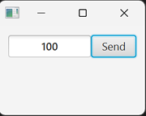

# JavaFX Builder API Project

This project offers a builder pattern API for JavaFX UI components, facilitating the creation of JavaFX applications through a fluent, strongly typed, and declarative approach.

The UI code that uses the builder API can represent nested structures that reflect the container hierarchy of the UI.

The builder API is generated by a code generator included in this project. This generator analyzes the JavaFX API using reflection and automatically produces builder classes.

```java
// Example using the builder API
StringProperty textProp = new SimpleStringProperty("100");

StageBuilder
    .withScene(
        SceneBuilder
            .withRoot(
                HBoxBuilder
                    .withChildren(
                        TextFieldBuilder.create()
                            .textPropertyApply(prop -> prop.bindBidirectional(textProp))
                            .style("""
                                   -fx-font-weight: bold;
                                   -fx-alignment: center;
                                   """)
                            .hGrowInHBox(Priority.ALWAYS)
                            .maxWidth(Double.MAX_VALUE)
                            .build(),
                        ButtonBuilder.create()
                            .text("Send")
                            .onAction(e -> System.out.println("Sending..."))
                            .minWidth(50)
                            .build()
                    )
                    .padding(new Insets(10))
                    .build()
            )
            .width(150)
            .height(100)
            .build()
    )
    .build()
    .show();
```


## Background

This project aims to reintroduce builder classes to JavaFX.

The builder classes were included in JavaFX 2 but were removed from the official class library due to concerns about maintenance overhead and memory usage, as noted in a 2013 post:

https://mail.openjdk.org/pipermail/openjfx-dev/2013-March/006725.html

The three advantages of the builder classes mentioned in that post remain valid today:
- Ability to set up generic configurations once and "stamp out" multiple copies.
- Structured code style that closely approximates the "container hierarchy" of the UI.
- Strongly-typed "declarative" style programming.

These advantages are especially appealing for JavaFX users working with Java (rather than Scala or Kotlin), as they enable a declarative and hierarchical coding style typical of other frameworks.

Concerns about memory usage have likely decreased compared to a decade ago. 
Even if they are not included in the official JavaFX API, it is beneficial for third parties to offer builder classes as an option.

My approach utilizes reflection to automatically generate the builder classes, while certain aspects that cannot be automated are handled through a few mapping rules. 
Unlike JavaFX 2.0, the builder classes do not have inheritance relationships, which may increase memory consumption.
Additionally, builders may incur call overhead.
Nonetheless, the builder classes appeal to those who prefer this programming style.

## Use of JavaFX Builder API 

The API has not yet been registered with Maven Central, but you can try it out using the SNAPSHOT version.

The SNAPSHOT version will soon be discontinued and replaced by a stable release. Please plan to update accordingly.

You can also generate and install the API in your local repository for your use.

To generate it yourself, please refer to the instructions in [Generate builder classes](./docs/BUILD.md).

## Builder API

**API Overview**:

 [JavaFX Builder API](./docs/API.md).

**JavaDoc pages**:

https://sosuisen.github.io/javafx-builder-api-generator/

**Generated Source Code**: 

The generated JavaFX Builder API source code is available at:
https://github.com/sosuisen/javafx-builder-api-generator/tree/main/api/

Most of the code comprises simple wrapper classes generated through mechanical transformation rules outlined in [./docs/API.md](./docs/API.md).

## About Component

**Important**: Currently not available in Maven Central. SNAPSHOT only.

### groupId

io.github.sosuisen

### artifactId

Add builder components corresponding to the JavaFX components specified in your dependencies.

e.g.) The builder class component corresponding to `javafx-controls` is `javafx-builder-controls`.

### version

Specify a builder with the same major version as the JavaFX major version.

### Examples

In the example below, please specify a version for `${javafx.builder.version}`.

#### javafx-controls

|type       |name                                      |
|-----------|------------------------------------------|
|JPMS module|io.github.sosuisen.api.jfxbuilder.controls|
|package    |io.github.sosuisen.jfxbuilder.controls    |

```xml
<dependency>
      <groupId>io.github.sosuisen</groupId>
      <artifactId>javafx-builder-controls</artifactId>     
      <version>${javafx.builder.version}</version>
</dependency>
```

#### javafx-graphics

|type       |name                                      |
|-----------|------------------------------------------|
|JPMS module|io.github.sosuisen.api.jfxbuilder.graphics|
|package    |io.github.sosuisen.jfxbuilder.graphics    |

```xml
<dependency>
      <groupId>io.github.sosuisen</groupId>
      <artifactId>javafx-builder-graphics</artifactId>     
      <version>${javafx.builder.version}</version>
</dependency>      
```

#### javafx-media

|type       |name                                      |
|-----------|------------------------------------------|
|JPMS module|io.github.sosuisen.api.jfxbuilder.media   |
|package    |io.github.sosuisen.jfxbuilder.media       |

```xml
<dependency>
      <groupId>io.github.sosuisen</groupId>
      <artifactId>javafx-builder-media</artifactId>     
      <version>${javafx.builder.version}</version>
</dependency>      
```

#### javafx-web

|type       |name                                      |
|-----------|------------------------------------------|
|JPMS module|io.github.sosuisen.api.jfxbuilder.web     |
|package    |io.github.sosuisen.jfxbuilder.web         |

```xml
<dependency>
      <groupId>io.github.sosuisen</groupId>
      <artifactId>javafx-builder-web</artifactId>     
      <version>${javafx.builder.version}</version>
</dependency>      
```

### Example of pom.xml

```xml
  <properties>
    <javafx.version>24.0.2</javafx.version>
    <javafx.builder.version>24.0.0-SNAPSHOT</javafx.builder.version>
  </properties>
  <!-- If you are using the SNAPSHOT version, you need to add the maven-snapshots repository. -->
  <repositories>
    <repository>
      <name>Central Portal Snapshots</name>
      <id>central-portal-snapshots</id>
      <url>https://central.sonatype.com/repository/maven-snapshots/</url>
      <releases>
        <enabled>false</enabled>
      </releases>
      <snapshots>
        <enabled>true</enabled>
      </snapshots>
    </repository>
  </repositories>

  <dependencies>
    <dependency>
      <groupId>org.openjfx</groupId>
      <artifactId>javafx-controls</artifactId>
      <version>${javafx.version}</version>
    </dependency>
    <dependency>    
      <groupId>org.openjfx</groupId>
      <artifactId>javafx-graphics</artifactId>     
      <version>${javafx.version}</version>
    </dependency>
    <dependency>
      <groupId>io.github.sosuisen</groupId>
      <artifactId>javafx-builder-controls</artifactId>
      <version>${javafx.builder.version}</version>
    </dependency>
    <dependency>    
      <groupId>io.github.sosuisen</groupId>
      <artifactId>javafx-builder-graphics</artifactId>     
      <version>${javafx.builder.version}</version>
    </dependency>
 </dependencies>
```

### Transitive dependencies

The builder implementation depends solely on the original JavaFX compoment. 

**Important**: Maven automatically manages transitive dependencies for JavaFX components; however, builder API components must be installed individually.

For example, `javafx-builder-graphics` is generally required when your project depends on `javafx-controls`, since `javafx-graphics` is a transitive dependency.

pom.xml
```xml
  <dependencies>
    <dependency>
      <groupId>org.openjfx</groupId>
      <artifactId>javafx-controls</artifactId>
      <version>${javafx.version}</version>
    </dependency>
    <dependency>
      <groupId>io.github.sosuisen</groupId>
      <artifactId>javafx-builder-controls</artifactId>
      <version>${javafx.builder.version}</version>
    </dependency>
    <dependency>    
      <groupId>io.github.sosuisen</groupId>
      <artifactId>javafx-builder-graphics</artifactId>     
      <version>${javafx.builder.version}</version>
    </dependency>   
  </dependencies>
```

module-info.java
```java
module com.example.app {
    requires javafx.controls;
    requires io.github.sosuisen.api.jfxbuilder.controls;
    requires io.github.sosuisen.api.jfxbuilder.graphics;

    opens com.example to javafx.graphics;
}
```

## Formatter

For comfortable use of the JavaFX Builder API, maintain matching indentation of opening and closing parentheses.

I have prepared an Eclipse code formatter profile (XML) for the JavaFX Builder API.

You can import it into your IDE or place it in your project folder.

Download it here: [Customized GoogleStyle for JavaFX builder](./styles_for_jfxbuilder.xml)

## Sample Project Using Builder API

The BMI (Body Mass Index) calculator demonstrates modern JavaFX development utilizing MVVM architecture, fluent UI construction, and internationalization support.

https://github.com/sosuisen/bmi-mvvm-with-builder

## LICENSE

MIT
