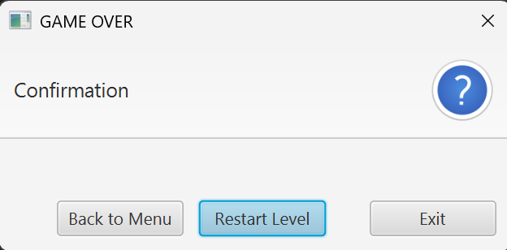

# JavaFX Builder API

The builder classes offer a fluent API for creating JavaFX components in the following way:

```java
// Example using the builder API
StringProperty textProp = new SimpleStringProperty("100");

StageBuilder
    .withScene(
        SceneBuilder
            .withRoot(
                HBoxBuilder
                    .withChildren(
                        TextFieldBuilder.create()
                            .textPropertyApply(prop -> prop.bindBidirectional(textProp))
                            .style("""
                                   -fx-font-weight: bold;
                                   -fx-alignment: center;
                                   """)
                            .hGrowInHBox(Priority.ALWAYS)
                            .maxWidth(Double.MAX_VALUE)
                            .build(),
                        ButtonBuilder.create()
                            .text("Send")
                            .onAction(e -> System.out.println("Sending..."))
                            .minWidth(50)
                            .build()
                    )
                    .padding(new Insets(10))
                    .build()
            )
            .width(150)
            .height(100)
            .build()
    )
    .build()
    .show();
```


# Basic API

The builder classes generally offer a fluent API with names derived from the original class API using simple conventions.

## Builder Class

A builder class is created for each `javafx.scene.*` class.

Class naming convention:
```
[Original class name] + "Builder"
```

When the original class is a public inner class:

```
[Outer class name] + [Inner class name] + "Builder"
```

Examples:
- `Button` -> `ButtonBuilder`
- `XYChart.Data` -> `XYChartDataBuilder`

## Create Methods (Static)

Each builder class includes **static** `create` methods that accept the same arguments as the original class constructors. This `create` method enables a fluent API by returning an instance of the builder class.

Examples:
- `Button()` -> `ButtonBuilder.create()`
- `Button(String text)` -> `ButtonBuilder.create(String text)`

## Build Method

The `build` method builds and returns an instance of the original class.

Note that intermediate builder methods are not evaluated until the build() method is called; in other words, they are evaluated lazily.

Example:
```java
Button btn = ButtonBuilder.create().build();
```

## Setter Methods

Each builder class includes setter methods named `XXX` where the name corresponds to the original class setter. This is achieved by removing `set` from `setXXX` and making the first letter lowercase.

Method naming convention:
```
[Method name without "set" and with the first letter in lowercase]
```

Example:
```java
// The original class
var btn1 = new Button();
btn.setText("hello");

// The builder class has a `text(String value)` method
var btn2 = ButtonBuilder.create()
    .text("hello")
    .build();
```

Exception:
- **Class methods** that start with 'set' are ignored.

## Apply Method

When you call `apply()` with a functional interface(Consumer<T>) during the building process, it provides access to the instance currently being built.

Examples:
```java
// The original class
var btn1 = new Button();
btn1.textProperty().bind(prop);

// The builder class has an `apply(Consumer<Button> func)` method
var btn2 = ButtonBuilder.create()
    .apply(btn -> btn.textProperty().bind(prop))
    .build();
```

Most goals can be accomplished using this `apply` method. However, for commonly used patterns, extra API (to be introduced later) are provided for more concise code.


# Extra API

You can utilize the builder classes by mastering only the Basic API. Additionally, several utilities are provided as Extra API for commonly used patterns.

## xxxPropertyApply - Access to Property

You can directly access many properties of the instance using `xxxPropertyApply` methods. 

Method naming convention:
```
[Property name]  + "Apply"
```

For example, the following `apply` notation has a shorthand form:

- Original form: `.apply(obj -> obj.textProperty().bind(anotherProperty))`

- Shorthand form: `.textPropertyApply(prop -> prop.bind(anotherProperty))`


## xxxIn{ContainerClass} - Parent Container Methods Called from Child Nodes

All static setter methods of `javafx.scene.layout.Pane` container classes are reciprocally implemented as instance methods in Node-inheriting classes.

Method naming convention:
```
[Method name without "set" and with the first letter in lowercase] + "In" + [Container class name]
```

Examples: 

`HBox`'s `setMargin(Node child, Inset value)` becomes the `marginInHBox(Inset value)` method available on all classes that extend Node.

Original form:
```java
var btn = new Button();
var hbox = new HBox(btn);
HBox.setMargin(btn, new Insets(10));

```
Fluent form:
```java
HBoxBuilder
    .create(
        ButtonBuilder.create()
            .marginInHBox(new Insets(10))
            .build()
    )
    .build();
```

## Add Method - Get ObservableList and Add Items

When the original class has a method that returns an `ObservableList` via `getXXX` method, the builder class has `addXXX` shortcuts.

Method naming convention and its arguments:
```
add + [Method name without "get"] + (T... elements)
add + [Method name without "get"] + (java.util.Collection<? extends T> col)
```

For example, the following `apply` notations have shorthand forms:
- Original form 1: `VBoxBuilder.create().apply(vbox -> vbox.getChildren().addAll(elements))`
- Shorthand form 1: `VBoxBuilder.create().addChildren(elements)`
- Original form 2: `VBoxBuilder.create().apply(vbox -> vbox.getChildren().addAll(col))`
- Shorthand form 2: `VBoxBuilder.create().addChildren(col)`

Exception:
- `getChildrenUnmodifiable` is excluded.

## With Method (Static)

Builder classes that have an `addXXX` method also have a **static** `withXXX` method that takes the same arguments.

This method creates and returns an instance of the builder class, then executes the `addXXX` method.

Examples:

- Original form: `VBoxBuilder.create(elements)`
- Another form: `VBoxBuilder.create().apply(vbox -> vbox.getChildren().addAll(elements))`
- Shorthand of the another form: `VBoxBuilder.withChildren(elements)`
 
Container classes include those like VBox where children can be specified in the constructor, and those like GridPane where children cannot be specified in the constructor.
Therefore, having all containers able to create builders with child elements via `withXXX` methods provides better consistency.

Exceptions:
- Essentially, `withXXX` is not available if the original class lacks a default constructor. This primarily applies to Skin Classes within the `javafx.scene.control.skin` package. 
- Although [Alert](#alert) class and subclasses of [XYChart](#xychart) also do not have default constructors, they uniquely include `withXXX` methods. (Refer to individual sections for more details.)
- `withXXX` is applied to structural containment relationships. The following appearance-related methods are excluded:
  - `getStylesheets`
  - `getTransforms`
  - `getStyleClass`

Note:
- Since it's "addAll", it's merely adding values to the default `ObservableList`. Use this when values can be fixed rather than reactive.
- When you want to replace the entire `ObservableList` itself, use the default setter provided by the Basic API.
- Example:
  - `ListViewBuilder.create().items(ObservableList list)`

## Styles

### addStylesheetsText

The `Scene` class and classes that inherit from `Parent` have an `addStylesheets(String... elements)` method according to the rule above. Its arguments are CSS URLs.

They also have an `addStylesheetsText(String css)` method, a utility setter to add a CSS string directly.

Example:
```
SceneBuilder.create().addStylesheetsText(".my-button { -fx-text-fill: white; }")
```

### Default styleClass for Container Classes

In JavaFX, only classes in the `javafx.scene.control` package have default style classes based on their class names.

Example: `Button` can be referenced with the `.button` selector.

For instances created by builders, default style classes are also set for container classes in `javafx.scene.layout.Pane`.

Example: `BorderPane` becomes referenceable with the `.border-pane` selector.

## Class-Specific API

### Stage

The `StageBuilder` class includes a **static** `withScene(Scene scene)` method
that creates an instance of the builder and then calls the `setScene(Scene scene)` method.
This shorthand ensures consistency with other methods, such as the `withChildren` method found in container classes.

The `Stage` class does not have a setter for the `StageStyle` constructor argument, but `StageBuilder` provides a `stageStyle` method.

### Scene

The `SceneBuilder` class includes a **static** `withRoot(Parent root)` method
that performs the same processing as the create(Parent root) method.
This alias ensures consistency with other methods, such as the `withChildren` method found in container classes.

The `Scene` class does not have setters for the constructor arguments `width`, `height`, `depthBuffer`, and `antiAliasing`, but `SceneBuilder` provides setters for them.

Example:
```java
StageBuilder
    .withScene(
        SceneBuilder
            .withRoot(
                AnchorPaneBuilder
                    .withChildren(
                        LabelBuilder.create()
                            .text("Hello, JavaFX!")
                            .style("-fx-font-weight: bold;")
                            .build()
                    )
                    .build()
            )
            .build()
    )
    .width(640)
    .height(480)
    .build();

```

### BorderPane

The `BorderPaneBuilder` class includes **static** `withCenter`, `withLeft`, `withRight`, `withBottom` and `withTop` methods to maintain consistency with methods like `withChildren`.

### GridPane

Builder classes generally only have shortcuts for `setXXX` methods, but `GridPaneBuilder` has methods with the same name and arguments for the following original methods:
- add(Node, columnIndex, rowIndex)
- add(Node, columnIndex, rowIndex, colspan, rowspan)
- addRow(rowIndex, children)
- addColumn(columnIndex, children)

Examples:
```java
GridPaneBuilder.create()
    .add(
        LabelBuilder.create()
            .text("Hello")
            .alignment(Pos.CENTER)
            .build(),
        0, 0
    )
    .build();
```

```java
GridPaneBuilder.create()
    .addRow(
        0,
        LabelBuilder.create()
            .text(I18n.get("name"))
            .alignment(Pos.CENTER)
            .build(),
        TextFieldBuilder.create()
            .alignment(Pos.CENTER)
            .build()
    )
    .addRow(
        1,
        LabelBuilder.create()
            .text(I18n.get("age"))
            .alignment(Pos.CENTER)
            .build(),
        TextFieldBuilder.create()
            .alignment(Pos.CENTER)
            .build()
    )
    .build();
```

### XYChart

Subclasses of XYChart include **static** `withData(XYChart.Series<X, Y>... elements)` and `withData(Collection<? extends XYChart.Series<X, Y>> col)` methods to maintain consistency with methods like `withChildren`.

`withData` method creates an instance of the builder, then calls the `addAll(XYChart.Series<X, Y>... elements)` method on the `ObservableList` returned by the `XYChart#getData()` method.

After calling this method, you may need to invoke the `xAxis(Axis)` and `yAxis(Axis)` methods. If you do not, the default axis objects will be set for the x-axis and y-axis.

The default axis classes are inferred from the type parameters of `XYChart.Data<X, Y>` objects contained in the `XYChart.Series` passed to the `withData` method. If the type is `String`, the axis object is created using `new CategoryAxis()`. If it's `Number`, it is created using `new NumberAxis()`. When there are no `Data` objects, the default x-axis object is created using `new CategoryAxis()` and the default y-axis object is created using `new NumberAxis()`.

The `XYChart` class does not have setters for the constructor arguments `xAxis` and `yAxis`, but the builder classes of its subclasses do provide setters for these arguments.

Examples:
```java
AreaChart<String, Integer> areaChart = AreaChartBuilder
    .withData(
        XYChartSeriesBuilder
            .withData(
                new XYChart.Data<>("A", 10),
                new XYChart.Data<>("B", 20)
            )
            .build(),
        XYChartSeriesBuilder
            .withData(
                new XYChart.Data<>("A", 5),
                new XYChart.Data<>("B", 30)
            )
            .build()
    )
    .legendVisible(false)
    .build();
```
```java
LineChart<Number, Number> lineChart = LineChartBuilder
    .withData(
        XYChartSeriesBuilder
            .withData(
                new XYChart.Data<Number, Number>(10, 10.5),
                new XYChart.Data<Number, Number>(20, 30.5)
            )
            .build()
    )
    .xAxis(
        NumberAxisBuilder.create()
            .labelPropertyApply(prop -> prop.bind(xLabelProp))
            .build()
    )
    .yAxis(
        NumberAxisBuilder.create()
            .labelPropertyApply(prop -> prop.bind(yLabelProp))
            .build()
    )
    .prefWidth(300)
    .minWidth(200)
    .build();
```

Note:
- Since it's "addAll", it's merely adding values to the default `ObservableList`. Use this when values can be fixed rather than reactive.
- When you want to replace the entire `ObservableList` itself, use the default setter provided by the Basic API.

### Alert

`Alert` class includes **static** `withButtonTypes(ButtonType... elements)` and `withButtonTypes(Collection<? extends ButtonType> col)` methods
to maintain consistency with methods like `withChildren`.

`withData` method creates an instance of the `AlertBuilder`, 
then calls the addAll(ButtonType... elements) method on the ObservableList returned by the Alert#getButtonTypes() method.

After calling this method, you can invoke the alertType(AlertType) method. If you choose not to do so, the default AlertType.NONE will be set.

Examples:
```java
AlertBuilder
    .withButtonTypes(
        new ButtonType("Restart Level", ButtonData.NEXT_FORWARD),
        new ButtonType("Back to Menu", ButtonData.BACK_PREVIOUS),
        new ButtonType("Exit", ButtonData.CANCEL_CLOSE)
    )
    .alertType(AlertType.CONFIRMATION)    
    .title("GAME OVER")
    .build()
    .showAndWait()
    .ifPresent(buttonType -> {
        switch (buttonType.getButtonData()) {
            case NEXT_FORWARD -> System.out.println("Restart Level");
            case BACK_PREVIOUS -> System.out.println("Back to Menu");
            case CANCEL_CLOSE -> System.out.println("Exit");
            default -> throw new IllegalStateException();
        }
    });
```


Code example without using withButtonTypes:
```java
AlertBuilder
    .create(AlertType.ERROR)
    .title("Error")
    .headerText("Fatal Error")
    .height(240)
    .width(480)
    .apply(alert -> {
        alert.getDialogPane()
            .setExpandableContent(
                new Label(
                    "ERROR: Failed to establish a database connection to the remote server."
                )
            );
        alert.getDialogPane().setExpanded(true);
    })
    .onHidden(_ -> Platform.exit())
    .build()
    .show();
```